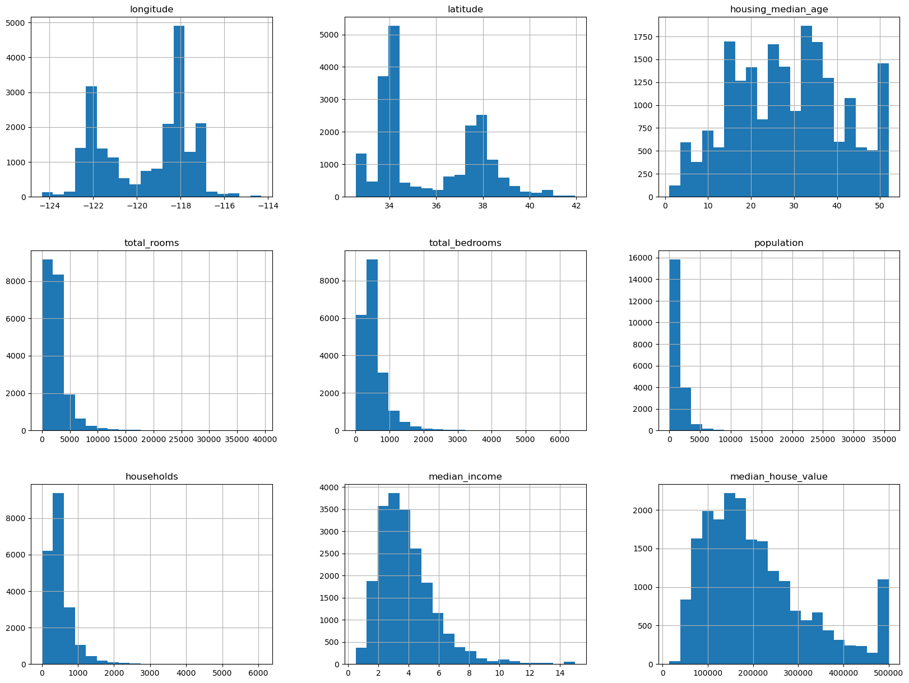
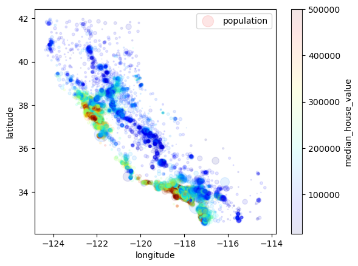
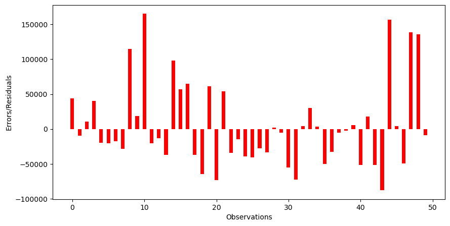

```python
#Libraries for this session
import warnings
import pandas as pd
import matplotlib.pyplot as plt
from sklearn.linear_model import LinearRegression
from category_encoders import OneHotEncoder
from sklearn.pipeline import Pipeline, make_pipeline
from sklearn.model_selection import train_test_split

warnings.simplefilter(action="ignore", category="FutureWarning")
```


```python
#Loading the dataset
df=pd.read_csv("California house price dataset.csv")
```


```python
df.info()
```

    <class 'pandas.core.frame.DataFrame'>
    RangeIndex: 20640 entries, 0 to 20639
    Data columns (total 10 columns):
     #   Column              Non-Null Count  Dtype  
    ---  ------              --------------  -----  
     0   longitude           20640 non-null  float64
     1   latitude            20640 non-null  float64
     2   housing_median_age  20640 non-null  int64  
     3   total_rooms         20640 non-null  int64  
     4   total_bedrooms      20433 non-null  float64
     5   population          20640 non-null  int64  
     6   households          20640 non-null  int64  
     7   median_income       20640 non-null  float64
     8   ocean_proximity     20640 non-null  object 
     9   median_house_value  20640 non-null  int64  
    dtypes: float64(4), int64(5), object(1)
    memory usage: 1.6+ MB
    


```python
df.head()
```


<div>
<style scoped>
    .dataframe tbody tr th:only-of-type {
        vertical-align: middle;
    }

    .dataframe tbody tr th {
        vertical-align: top;
    }

    .dataframe thead th {
        text-align: right;
    }
</style>
<table border="1" class="dataframe">
  <thead>
    <tr style="text-align: right;">
      <th></th>
      <th>longitude</th>
      <th>latitude</th>
      <th>housing_median_age</th>
      <th>total_rooms</th>
      <th>total_bedrooms</th>
      <th>population</th>
      <th>households</th>
      <th>median_income</th>
      <th>ocean_proximity</th>
      <th>median_house_value</th>
    </tr>
  </thead>
  <tbody>
    <tr>
      <th>0</th>
      <td>-122.23</td>
      <td>37.88</td>
      <td>41</td>
      <td>880</td>
      <td>129.0</td>
      <td>322</td>
      <td>126</td>
      <td>8.3252</td>
      <td>NEAR BAY</td>
      <td>452600</td>
    </tr>
    <tr>
      <th>1</th>
      <td>-122.22</td>
      <td>37.86</td>
      <td>21</td>
      <td>7099</td>
      <td>1106.0</td>
      <td>2401</td>
      <td>1138</td>
      <td>8.3014</td>
      <td>NEAR BAY</td>
      <td>358500</td>
    </tr>
    <tr>
      <th>2</th>
      <td>-122.24</td>
      <td>37.85</td>
      <td>52</td>
      <td>1467</td>
      <td>190.0</td>
      <td>496</td>
      <td>177</td>
      <td>7.2574</td>
      <td>NEAR BAY</td>
      <td>352100</td>
    </tr>
    <tr>
      <th>3</th>
      <td>-122.25</td>
      <td>37.85</td>
      <td>52</td>
      <td>1274</td>
      <td>235.0</td>
      <td>558</td>
      <td>219</td>
      <td>5.6431</td>
      <td>NEAR BAY</td>
      <td>341300</td>
    </tr>
    <tr>
      <th>4</th>
      <td>-122.25</td>
      <td>37.85</td>
      <td>52</td>
      <td>1627</td>
      <td>280.0</td>
      <td>565</td>
      <td>259</td>
      <td>3.8462</td>
      <td>NEAR BAY</td>
      <td>342200</td>
    </tr>
  </tbody>
</table>
</div>


```python
df.shape
```


    (20640, 10)


```python
df.describe().T
```


<div>
<style scoped>
    .dataframe tbody tr th:only-of-type {
        vertical-align: middle;
    }

    .dataframe tbody tr th {
        vertical-align: top;
    }

    .dataframe thead th {
        text-align: right;
    }
</style>
<table border="1" class="dataframe">
  <thead>
    <tr style="text-align: right;">
      <th></th>
      <th>count</th>
      <th>mean</th>
      <th>std</th>
      <th>min</th>
      <th>25%</th>
      <th>50%</th>
      <th>75%</th>
      <th>max</th>
    </tr>
  </thead>
  <tbody>
    <tr>
      <th>longitude</th>
      <td>20640.0</td>
      <td>-119.569704</td>
      <td>2.003532</td>
      <td>-124.3500</td>
      <td>-121.8000</td>
      <td>-118.4900</td>
      <td>-118.01000</td>
      <td>-114.3100</td>
    </tr>
    <tr>
      <th>latitude</th>
      <td>20640.0</td>
      <td>35.631861</td>
      <td>2.135952</td>
      <td>32.5400</td>
      <td>33.9300</td>
      <td>34.2600</td>
      <td>37.71000</td>
      <td>41.9500</td>
    </tr>
    <tr>
      <th>housing_median_age</th>
      <td>20640.0</td>
      <td>28.639486</td>
      <td>12.585558</td>
      <td>1.0000</td>
      <td>18.0000</td>
      <td>29.0000</td>
      <td>37.00000</td>
      <td>52.0000</td>
    </tr>
    <tr>
      <th>total_rooms</th>
      <td>20640.0</td>
      <td>2635.763081</td>
      <td>2181.615252</td>
      <td>2.0000</td>
      <td>1447.7500</td>
      <td>2127.0000</td>
      <td>3148.00000</td>
      <td>39320.0000</td>
    </tr>
    <tr>
      <th>total_bedrooms</th>
      <td>20433.0</td>
      <td>537.870553</td>
      <td>421.385070</td>
      <td>1.0000</td>
      <td>296.0000</td>
      <td>435.0000</td>
      <td>647.00000</td>
      <td>6445.0000</td>
    </tr>
    <tr>
      <th>population</th>
      <td>20640.0</td>
      <td>1425.476744</td>
      <td>1132.462122</td>
      <td>3.0000</td>
      <td>787.0000</td>
      <td>1166.0000</td>
      <td>1725.00000</td>
      <td>35682.0000</td>
    </tr>
    <tr>
      <th>households</th>
      <td>20640.0</td>
      <td>499.539680</td>
      <td>382.329753</td>
      <td>1.0000</td>
      <td>280.0000</td>
      <td>409.0000</td>
      <td>605.00000</td>
      <td>6082.0000</td>
    </tr>
    <tr>
      <th>median_income</th>
      <td>20640.0</td>
      <td>3.870671</td>
      <td>1.899822</td>
      <td>0.4999</td>
      <td>2.5634</td>
      <td>3.5348</td>
      <td>4.74325</td>
      <td>15.0001</td>
    </tr>
    <tr>
      <th>median_house_value</th>
      <td>20640.0</td>
      <td>206855.816909</td>
      <td>115395.615874</td>
      <td>14999.0000</td>
      <td>119600.0000</td>
      <td>179700.0000</td>
      <td>264725.00000</td>
      <td>500001.0000</td>
    </tr>
  </tbody>
</table>
</div>


```python
df["ocean_proximity"].unique()
```


    array(['NEAR BAY', '<1H OCEAN', 'INLAND', 'NEAR OCEAN', 'ISLAND'],
          dtype=object)


```python
df["ocean_proximity"].value_counts()
```


    ocean_proximity
    <1H OCEAN     9136
    INLAND        6551
    NEAR OCEAN    2658
    NEAR BAY      2290
    ISLAND           5
    Name: count, dtype: int64


```python
#Visualization
df.hist(bins=20,figsize=(20,15));
```


    

    


```python
#See the distribution via longitude and latitude
df.plot(kind="scatter", x="longitude", y="latitude", alpha=0.1,
       s=df["population"]/100,
       label="population",
       c="median_house_value",
       cmap=plt.get_cmap("jet")); #alpha for transparency, s for size, c for color, cmap for colormap, in this case jet is a predefined color map.
```


    

    


```python
#Removing the missing values in the "total_bedrooms"
df_na=df.dropna(subset=["total_bedrooms"])
df_na.shape
```


    (20433, 10)


```python
df_na.isnull().sum()
```


    longitude             0
    latitude              0
    housing_median_age    0
    total_rooms           0
    total_bedrooms        0
    population            0
    households            0
    median_income         0
    ocean_proximity       0
    median_house_value    0
    dtype: int64


```python
df_encoded = pd.get_dummies(df_na, columns=["ocean_proximity"], dtype=int)
df_encoded.head()
```


<div>
<style scoped>
    .dataframe tbody tr th:only-of-type {
        vertical-align: middle;
    }

    .dataframe tbody tr th {
        vertical-align: top;
    }

    .dataframe thead th {
        text-align: right;
    }
</style>
<table border="1" class="dataframe">
  <thead>
    <tr style="text-align: right;">
      <th></th>
      <th>longitude</th>
      <th>latitude</th>
      <th>housing_median_age</th>
      <th>total_rooms</th>
      <th>total_bedrooms</th>
      <th>population</th>
      <th>households</th>
      <th>median_income</th>
      <th>median_house_value</th>
      <th>ocean_proximity_&lt;1H OCEAN</th>
      <th>ocean_proximity_INLAND</th>
      <th>ocean_proximity_ISLAND</th>
      <th>ocean_proximity_NEAR BAY</th>
      <th>ocean_proximity_NEAR OCEAN</th>
    </tr>
  </thead>
  <tbody>
    <tr>
      <th>0</th>
      <td>-122.23</td>
      <td>37.88</td>
      <td>41</td>
      <td>880</td>
      <td>129.0</td>
      <td>322</td>
      <td>126</td>
      <td>8.3252</td>
      <td>452600</td>
      <td>0</td>
      <td>0</td>
      <td>0</td>
      <td>1</td>
      <td>0</td>
    </tr>
    <tr>
      <th>1</th>
      <td>-122.22</td>
      <td>37.86</td>
      <td>21</td>
      <td>7099</td>
      <td>1106.0</td>
      <td>2401</td>
      <td>1138</td>
      <td>8.3014</td>
      <td>358500</td>
      <td>0</td>
      <td>0</td>
      <td>0</td>
      <td>1</td>
      <td>0</td>
    </tr>
    <tr>
      <th>2</th>
      <td>-122.24</td>
      <td>37.85</td>
      <td>52</td>
      <td>1467</td>
      <td>190.0</td>
      <td>496</td>
      <td>177</td>
      <td>7.2574</td>
      <td>352100</td>
      <td>0</td>
      <td>0</td>
      <td>0</td>
      <td>1</td>
      <td>0</td>
    </tr>
    <tr>
      <th>3</th>
      <td>-122.25</td>
      <td>37.85</td>
      <td>52</td>
      <td>1274</td>
      <td>235.0</td>
      <td>558</td>
      <td>219</td>
      <td>5.6431</td>
      <td>341300</td>
      <td>0</td>
      <td>0</td>
      <td>0</td>
      <td>1</td>
      <td>0</td>
    </tr>
    <tr>
      <th>4</th>
      <td>-122.25</td>
      <td>37.85</td>
      <td>52</td>
      <td>1627</td>
      <td>280.0</td>
      <td>565</td>
      <td>259</td>
      <td>3.8462</td>
      <td>342200</td>
      <td>0</td>
      <td>0</td>
      <td>0</td>
      <td>1</td>
      <td>0</td>
    </tr>
  </tbody>
</table>
</div>


```python
#Target and features
X=df_encoded.drop(columns=["median_house_value"])
X.head()
y=df_encoded["median_house_value"]
y.head()
```


    0    452600
    1    358500
    2    352100
    3    341300
    4    342200
    Name: median_house_value, dtype: int64


```python
#Randomized Train-Test Split
X_train, X_test, y_train, y_test=train_test_split(X, y, test_size=0.2, random_state=42)
print("X_train shape:",X_train.shape)
print("y_train shape:",y_train.shape)
print("X_test shape:",X_test.shape)
print("y_test shape:",y_test.shape)
```

    X_train shape: (16346, 13)
    y_train shape: (16346,)
    X_test shape: (4087, 13)
    y_test shape: (4087,)
    


```python
#Model
model=LinearRegression()
```


```python
model.fit(X_train,y_train)
```


<style>#sk-container-id-1 {
  /* Definition of color scheme common for light and dark mode */
  --sklearn-color-text: #000;
  --sklearn-color-text-muted: #666;
  --sklearn-color-line: gray;
  /* Definition of color scheme for unfitted estimators */
  --sklearn-color-unfitted-level-0: #fff5e6;
  --sklearn-color-unfitted-level-1: #f6e4d2;
  --sklearn-color-unfitted-level-2: #ffe0b3;
  --sklearn-color-unfitted-level-3: chocolate;
  /* Definition of color scheme for fitted estimators */
  --sklearn-color-fitted-level-0: #f0f8ff;
  --sklearn-color-fitted-level-1: #d4ebff;
  --sklearn-color-fitted-level-2: #b3dbfd;
  --sklearn-color-fitted-level-3: cornflowerblue;

  /* Specific color for light theme */
  --sklearn-color-text-on-default-background: var(--sg-text-color, var(--theme-code-foreground, var(--jp-content-font-color1, black)));
  --sklearn-color-background: var(--sg-background-color, var(--theme-background, var(--jp-layout-color0, white)));
  --sklearn-color-border-box: var(--sg-text-color, var(--theme-code-foreground, var(--jp-content-font-color1, black)));
  --sklearn-color-icon: #696969;

  @media (prefers-color-scheme: dark) {
    /* Redefinition of color scheme for dark theme */
    --sklearn-color-text-on-default-background: var(--sg-text-color, var(--theme-code-foreground, var(--jp-content-font-color1, white)));
    --sklearn-color-background: var(--sg-background-color, var(--theme-background, var(--jp-layout-color0, #111)));
    --sklearn-color-border-box: var(--sg-text-color, var(--theme-code-foreground, var(--jp-content-font-color1, white)));
    --sklearn-color-icon: #878787;
  }
}

#sk-container-id-1 {
  color: var(--sklearn-color-text);
}

#sk-container-id-1 pre {
  padding: 0;
}

#sk-container-id-1 input.sk-hidden--visually {
  border: 0;
  clip: rect(1px 1px 1px 1px);
  clip: rect(1px, 1px, 1px, 1px);
  height: 1px;
  margin: -1px;
  overflow: hidden;
  padding: 0;
  position: absolute;
  width: 1px;
}

#sk-container-id-1 div.sk-dashed-wrapped {
  border: 1px dashed var(--sklearn-color-line);
  margin: 0 0.4em 0.5em 0.4em;
  box-sizing: border-box;
  padding-bottom: 0.4em;
  background-color: var(--sklearn-color-background);
}

#sk-container-id-1 div.sk-container {
  /* jupyter's `normalize.less` sets `[hidden] { display: none; }`
     but bootstrap.min.css set `[hidden] { display: none !important; }`
     so we also need the `!important` here to be able to override the
     default hidden behavior on the sphinx rendered scikit-learn.org.
     See: https://github.com/scikit-learn/scikit-learn/issues/21755 */
  display: inline-block !important;
  position: relative;
}

#sk-container-id-1 div.sk-text-repr-fallback {
  display: none;
}

div.sk-parallel-item,
div.sk-serial,
div.sk-item {
  /* draw centered vertical line to link estimators */
  background-image: linear-gradient(var(--sklearn-color-text-on-default-background), var(--sklearn-color-text-on-default-background));
  background-size: 2px 100%;
  background-repeat: no-repeat;
  background-position: center center;
}

/* Parallel-specific style estimator block */

#sk-container-id-1 div.sk-parallel-item::after {
  content: "";
  width: 100%;
  border-bottom: 2px solid var(--sklearn-color-text-on-default-background);
  flex-grow: 1;
}

#sk-container-id-1 div.sk-parallel {
  display: flex;
  align-items: stretch;
  justify-content: center;
  background-color: var(--sklearn-color-background);
  position: relative;
}

#sk-container-id-1 div.sk-parallel-item {
  display: flex;
  flex-direction: column;
}

#sk-container-id-1 div.sk-parallel-item:first-child::after {
  align-self: flex-end;
  width: 50%;
}

#sk-container-id-1 div.sk-parallel-item:last-child::after {
  align-self: flex-start;
  width: 50%;
}

#sk-container-id-1 div.sk-parallel-item:only-child::after {
  width: 0;
}

/* Serial-specific style estimator block */

#sk-container-id-1 div.sk-serial {
  display: flex;
  flex-direction: column;
  align-items: center;
  background-color: var(--sklearn-color-background);
  padding-right: 1em;
  padding-left: 1em;
}


/* Toggleable style: style used for estimator/Pipeline/ColumnTransformer box that is
clickable and can be expanded/collapsed.
- Pipeline and ColumnTransformer use this feature and define the default style
- Estimators will overwrite some part of the style using the `sk-estimator` class
*/

/* Pipeline and ColumnTransformer style (default) */

#sk-container-id-1 div.sk-toggleable {
  /* Default theme specific background. It is overwritten whether we have a
  specific estimator or a Pipeline/ColumnTransformer */
  background-color: var(--sklearn-color-background);
}

/* Toggleable label */
#sk-container-id-1 label.sk-toggleable__label {
  cursor: pointer;
  display: flex;
  width: 100%;
  margin-bottom: 0;
  padding: 0.5em;
  box-sizing: border-box;
  text-align: center;
  align-items: start;
  justify-content: space-between;
  gap: 0.5em;
}

#sk-container-id-1 label.sk-toggleable__label .caption {
  font-size: 0.6rem;
  font-weight: lighter;
  color: var(--sklearn-color-text-muted);
}

#sk-container-id-1 label.sk-toggleable__label-arrow:before {
  /* Arrow on the left of the label */
  content: "▸";
  float: left;
  margin-right: 0.25em;
  color: var(--sklearn-color-icon);
}

#sk-container-id-1 label.sk-toggleable__label-arrow:hover:before {
  color: var(--sklearn-color-text);
}

/* Toggleable content - dropdown */

#sk-container-id-1 div.sk-toggleable__content {
  display: none;
  text-align: left;
  /* unfitted */
  background-color: var(--sklearn-color-unfitted-level-0);
}

#sk-container-id-1 div.sk-toggleable__content.fitted {
  /* fitted */
  background-color: var(--sklearn-color-fitted-level-0);
}

#sk-container-id-1 div.sk-toggleable__content pre {
  margin: 0.2em;
  border-radius: 0.25em;
  color: var(--sklearn-color-text);
  /* unfitted */
  background-color: var(--sklearn-color-unfitted-level-0);
}

#sk-container-id-1 div.sk-toggleable__content.fitted pre {
  /* unfitted */
  background-color: var(--sklearn-color-fitted-level-0);
}

#sk-container-id-1 input.sk-toggleable__control:checked~div.sk-toggleable__content {
  /* Expand drop-down */
  display: block;
  width: 100%;
  overflow: visible;
}

#sk-container-id-1 input.sk-toggleable__control:checked~label.sk-toggleable__label-arrow:before {
  content: "▾";
}

/* Pipeline/ColumnTransformer-specific style */

#sk-container-id-1 div.sk-label input.sk-toggleable__control:checked~label.sk-toggleable__label {
  color: var(--sklearn-color-text);
  background-color: var(--sklearn-color-unfitted-level-2);
}

#sk-container-id-1 div.sk-label.fitted input.sk-toggleable__control:checked~label.sk-toggleable__label {
  background-color: var(--sklearn-color-fitted-level-2);
}

/* Estimator-specific style */

/* Colorize estimator box */
#sk-container-id-1 div.sk-estimator input.sk-toggleable__control:checked~label.sk-toggleable__label {
  /* unfitted */
  background-color: var(--sklearn-color-unfitted-level-2);
}

#sk-container-id-1 div.sk-estimator.fitted input.sk-toggleable__control:checked~label.sk-toggleable__label {
  /* fitted */
  background-color: var(--sklearn-color-fitted-level-2);
}

#sk-container-id-1 div.sk-label label.sk-toggleable__label,
#sk-container-id-1 div.sk-label label {
  /* The background is the default theme color */
  color: var(--sklearn-color-text-on-default-background);
}

/* On hover, darken the color of the background */
#sk-container-id-1 div.sk-label:hover label.sk-toggleable__label {
  color: var(--sklearn-color-text);
  background-color: var(--sklearn-color-unfitted-level-2);
}

/* Label box, darken color on hover, fitted */
#sk-container-id-1 div.sk-label.fitted:hover label.sk-toggleable__label.fitted {
  color: var(--sklearn-color-text);
  background-color: var(--sklearn-color-fitted-level-2);
}

/* Estimator label */

#sk-container-id-1 div.sk-label label {
  font-family: monospace;
  font-weight: bold;
  display: inline-block;
  line-height: 1.2em;
}

#sk-container-id-1 div.sk-label-container {
  text-align: center;
}

/* Estimator-specific */
#sk-container-id-1 div.sk-estimator {
  font-family: monospace;
  border: 1px dotted var(--sklearn-color-border-box);
  border-radius: 0.25em;
  box-sizing: border-box;
  margin-bottom: 0.5em;
  /* unfitted */
  background-color: var(--sklearn-color-unfitted-level-0);
}

#sk-container-id-1 div.sk-estimator.fitted {
  /* fitted */
  background-color: var(--sklearn-color-fitted-level-0);
}

/* on hover */
#sk-container-id-1 div.sk-estimator:hover {
  /* unfitted */
  background-color: var(--sklearn-color-unfitted-level-2);
}

#sk-container-id-1 div.sk-estimator.fitted:hover {
  /* fitted */
  background-color: var(--sklearn-color-fitted-level-2);
}

/* Specification for estimator info (e.g. "i" and "?") */

/* Common style for "i" and "?" */

.sk-estimator-doc-link,
a:link.sk-estimator-doc-link,
a:visited.sk-estimator-doc-link {
  float: right;
  font-size: smaller;
  line-height: 1em;
  font-family: monospace;
  background-color: var(--sklearn-color-background);
  border-radius: 1em;
  height: 1em;
  width: 1em;
  text-decoration: none !important;
  margin-left: 0.5em;
  text-align: center;
  /* unfitted */
  border: var(--sklearn-color-unfitted-level-1) 1pt solid;
  color: var(--sklearn-color-unfitted-level-1);
}

.sk-estimator-doc-link.fitted,
a:link.sk-estimator-doc-link.fitted,
a:visited.sk-estimator-doc-link.fitted {
  /* fitted */
  border: var(--sklearn-color-fitted-level-1) 1pt solid;
  color: var(--sklearn-color-fitted-level-1);
}

/* On hover */
div.sk-estimator:hover .sk-estimator-doc-link:hover,
.sk-estimator-doc-link:hover,
div.sk-label-container:hover .sk-estimator-doc-link:hover,
.sk-estimator-doc-link:hover {
  /* unfitted */
  background-color: var(--sklearn-color-unfitted-level-3);
  color: var(--sklearn-color-background);
  text-decoration: none;
}

div.sk-estimator.fitted:hover .sk-estimator-doc-link.fitted:hover,
.sk-estimator-doc-link.fitted:hover,
div.sk-label-container:hover .sk-estimator-doc-link.fitted:hover,
.sk-estimator-doc-link.fitted:hover {
  /* fitted */
  background-color: var(--sklearn-color-fitted-level-3);
  color: var(--sklearn-color-background);
  text-decoration: none;
}

/* Span, style for the box shown on hovering the info icon */
.sk-estimator-doc-link span {
  display: none;
  z-index: 9999;
  position: relative;
  font-weight: normal;
  right: .2ex;
  padding: .5ex;
  margin: .5ex;
  width: min-content;
  min-width: 20ex;
  max-width: 50ex;
  color: var(--sklearn-color-text);
  box-shadow: 2pt 2pt 4pt #999;
  /* unfitted */
  background: var(--sklearn-color-unfitted-level-0);
  border: .5pt solid var(--sklearn-color-unfitted-level-3);
}

.sk-estimator-doc-link.fitted span {
  /* fitted */
  background: var(--sklearn-color-fitted-level-0);
  border: var(--sklearn-color-fitted-level-3);
}

.sk-estimator-doc-link:hover span {
  display: block;
}

/* "?"-specific style due to the `<a>` HTML tag */

#sk-container-id-1 a.estimator_doc_link {
  float: right;
  font-size: 1rem;
  line-height: 1em;
  font-family: monospace;
  background-color: var(--sklearn-color-background);
  border-radius: 1rem;
  height: 1rem;
  width: 1rem;
  text-decoration: none;
  /* unfitted */
  color: var(--sklearn-color-unfitted-level-1);
  border: var(--sklearn-color-unfitted-level-1) 1pt solid;
}

#sk-container-id-1 a.estimator_doc_link.fitted {
  /* fitted */
  border: var(--sklearn-color-fitted-level-1) 1pt solid;
  color: var(--sklearn-color-fitted-level-1);
}

/* On hover */
#sk-container-id-1 a.estimator_doc_link:hover {
  /* unfitted */
  background-color: var(--sklearn-color-unfitted-level-3);
  color: var(--sklearn-color-background);
  text-decoration: none;
}

#sk-container-id-1 a.estimator_doc_link.fitted:hover {
  /* fitted */
  background-color: var(--sklearn-color-fitted-level-3);
}

.estimator-table summary {
    padding: .5rem;
    font-family: monospace;
    cursor: pointer;
}

.estimator-table details[open] {
    padding-left: 0.1rem;
    padding-right: 0.1rem;
    padding-bottom: 0.3rem;
}

.estimator-table .parameters-table {
    margin-left: auto !important;
    margin-right: auto !important;
}

.estimator-table .parameters-table tr:nth-child(odd) {
    background-color: #fff;
}

.estimator-table .parameters-table tr:nth-child(even) {
    background-color: #f6f6f6;
}

.estimator-table .parameters-table tr:hover {
    background-color: #e0e0e0;
}

.estimator-table table td {
    border: 1px solid rgba(106, 105, 104, 0.232);
}

.user-set td {
    color:rgb(255, 94, 0);
    text-align: left;
}

.user-set td.value pre {
    color:rgb(255, 94, 0) !important;
    background-color: transparent !important;
}

.default td {
    color: black;
    text-align: left;
}

.user-set td i,
.default td i {
    color: black;
}

.copy-paste-icon {
    background-image: url(data:image/svg+xml;base64,PHN2ZyB4bWxucz0iaHR0cDovL3d3dy53My5vcmcvMjAwMC9zdmciIHZpZXdCb3g9IjAgMCA0NDggNTEyIj48IS0tIUZvbnQgQXdlc29tZSBGcmVlIDYuNy4yIGJ5IEBmb250YXdlc29tZSAtIGh0dHBzOi8vZm9udGF3ZXNvbWUuY29tIExpY2Vuc2UgLSBodHRwczovL2ZvbnRhd2Vzb21lLmNvbS9saWNlbnNlL2ZyZWUgQ29weXJpZ2h0IDIwMjUgRm9udGljb25zLCBJbmMuLS0+PHBhdGggZD0iTTIwOCAwTDMzMi4xIDBjMTIuNyAwIDI0LjkgNS4xIDMzLjkgMTQuMWw2Ny45IDY3LjljOSA5IDE0LjEgMjEuMiAxNC4xIDMzLjlMNDQ4IDMzNmMwIDI2LjUtMjEuNSA0OC00OCA0OGwtMTkyIDBjLTI2LjUgMC00OC0yMS41LTQ4LTQ4bDAtMjg4YzAtMjYuNSAyMS41LTQ4IDQ4LTQ4ek00OCAxMjhsODAgMCAwIDY0LTY0IDAgMCAyNTYgMTkyIDAgMC0zMiA2NCAwIDAgNDhjMCAyNi41LTIxLjUgNDgtNDggNDhMNDggNTEyYy0yNi41IDAtNDgtMjEuNS00OC00OEwwIDE3NmMwLTI2LjUgMjEuNS00OCA0OC00OHoiLz48L3N2Zz4=);
    background-repeat: no-repeat;
    background-size: 14px 14px;
    background-position: 0;
    display: inline-block;
    width: 14px;
    height: 14px;
    cursor: pointer;
}
</style><body><div id="sk-container-id-1" class="sk-top-container"><div class="sk-text-repr-fallback"><pre>LinearRegression()</pre><b>In a Jupyter environment, please rerun this cell to show the HTML representation or trust the notebook. <br />On GitHub, the HTML representation is unable to render, please try loading this page with nbviewer.org.</b></div><div class="sk-container" hidden><div class="sk-item"><div class="sk-estimator fitted sk-toggleable"><input class="sk-toggleable__control sk-hidden--visually" id="sk-estimator-id-1" type="checkbox" checked><label for="sk-estimator-id-1" class="sk-toggleable__label fitted sk-toggleable__label-arrow"><div><div>LinearRegression</div></div><div><a class="sk-estimator-doc-link fitted" rel="noreferrer" target="_blank" href="https://scikit-learn.org/1.7/modules/generated/sklearn.linear_model.LinearRegression.html">?<span>Documentation for LinearRegression</span></a><span class="sk-estimator-doc-link fitted">i<span>Fitted</span></span></div></label><div class="sk-toggleable__content fitted" data-param-prefix="">
        <div class="estimator-table">
            <details>
                <summary>Parameters</summary>
                <table class="parameters-table">
                  <tbody>

        <tr class="default">
            <td><i class="copy-paste-icon"
                 onclick="copyToClipboard('fit_intercept',
                          this.parentElement.nextElementSibling)"
            ></i></td>
            <td class="param">fit_intercept&nbsp;</td>
            <td class="value">True</td>
        </tr>


        <tr class="default">
            <td><i class="copy-paste-icon"
                 onclick="copyToClipboard('copy_X',
                          this.parentElement.nextElementSibling)"
            ></i></td>
            <td class="param">copy_X&nbsp;</td>
            <td class="value">True</td>
        </tr>


        <tr class="default">
            <td><i class="copy-paste-icon"
                 onclick="copyToClipboard('tol',
                          this.parentElement.nextElementSibling)"
            ></i></td>
            <td class="param">tol&nbsp;</td>
            <td class="value">1e-06</td>
        </tr>


        <tr class="default">
            <td><i class="copy-paste-icon"
                 onclick="copyToClipboard('n_jobs',
                          this.parentElement.nextElementSibling)"
            ></i></td>
            <td class="param">n_jobs&nbsp;</td>
            <td class="value">None</td>
        </tr>


        <tr class="default">
            <td><i class="copy-paste-icon"
                 onclick="copyToClipboard('positive',
                          this.parentElement.nextElementSibling)"
            ></i></td>
            <td class="param">positive&nbsp;</td>
            <td class="value">False</td>
        </tr>

                  </tbody>
                </table>
            </details>
        </div>
    </div></div></div></div></div><script>function copyToClipboard(text, element) {
    // Get the parameter prefix from the closest toggleable content
    const toggleableContent = element.closest('.sk-toggleable__content');
    const paramPrefix = toggleableContent ? toggleableContent.dataset.paramPrefix : '';
    const fullParamName = paramPrefix ? `${paramPrefix}${text}` : text;

    const originalStyle = element.style;
    const computedStyle = window.getComputedStyle(element);
    const originalWidth = computedStyle.width;
    const originalHTML = element.innerHTML.replace('Copied!', '');

    navigator.clipboard.writeText(fullParamName)
        .then(() => {
            element.style.width = originalWidth;
            element.style.color = 'green';
            element.innerHTML = "Copied!";

            setTimeout(() => {
                element.innerHTML = originalHTML;
                element.style = originalStyle;
            }, 2000);
        })
        .catch(err => {
            console.error('Failed to copy:', err);
            element.style.color = 'red';
            element.innerHTML = "Failed!";
            setTimeout(() => {
                element.innerHTML = originalHTML;
                element.style = originalStyle;
            }, 2000);
        });
    return false;
}

document.querySelectorAll('.fa-regular.fa-copy').forEach(function(element) {
    const toggleableContent = element.closest('.sk-toggleable__content');
    const paramPrefix = toggleableContent ? toggleableContent.dataset.paramPrefix : '';
    const paramName = element.parentElement.nextElementSibling.textContent.trim();
    const fullParamName = paramPrefix ? `${paramPrefix}${paramName}` : paramName;

    element.setAttribute('title', fullParamName);
});
</script></body>


```python
#Coefficients and Intercept
print("Model's intercept is", model.intercept_)
print("Model's coefficients",model.coef_)
```

    Model's intercept is -2265004.318716112
    Model's coefficients [-2.71087463e+04 -2.56578075e+04  1.08136421e+03 -6.32214552e+00
      1.03004042e+02 -3.64097514e+01  4.31427249e+01  3.92770830e+04
     -3.42694434e+04 -7.35096612e+04  1.79383931e+05 -4.05018603e+04
     -3.11029663e+04]
    


```python
#Making predictions
y_pred=model.predict(X_test)
performance=pd.DataFrame({"ACTUAL VALUE":y_test, "PREDICTED VALUE":y_pred})
performance["error"]=performance["ACTUAL VALUE"]-performance["PREDICTED VALUE"]
performance.head()
```


<div>
<style scoped>
    .dataframe tbody tr th:only-of-type {
        vertical-align: middle;
    }

    .dataframe tbody tr th {
        vertical-align: top;
    }

    .dataframe thead th {
        text-align: right;
    }
</style>
<table border="1" class="dataframe">
  <thead>
    <tr style="text-align: right;">
      <th></th>
      <th>ACTUAL VALUE</th>
      <th>PREDICTED VALUE</th>
      <th>error</th>
    </tr>
  </thead>
  <tbody>
    <tr>
      <th>14416</th>
      <td>245800</td>
      <td>201882.959868</td>
      <td>43917.040132</td>
    </tr>
    <tr>
      <th>16383</th>
      <td>137900</td>
      <td>147279.682144</td>
      <td>-9379.682144</td>
    </tr>
    <tr>
      <th>7731</th>
      <td>218200</td>
      <td>207796.609798</td>
      <td>10403.390202</td>
    </tr>
    <tr>
      <th>1410</th>
      <td>220800</td>
      <td>180487.576722</td>
      <td>40312.423278</td>
    </tr>
    <tr>
      <th>1335</th>
      <td>170500</td>
      <td>190323.923130</td>
      <td>-19823.923130</td>
    </tr>
  </tbody>
</table>
</div>


```python
#Preparing to plot the dataset
performance.reset_index(drop=True,inplace=True)
performance.reset_index(inplace=True)
performance.head()
```


<div>
<style scoped>
    .dataframe tbody tr th:only-of-type {
        vertical-align: middle;
    }

    .dataframe tbody tr th {
        vertical-align: top;
    }

    .dataframe thead th {
        text-align: right;
    }
</style>
<table border="1" class="dataframe">
  <thead>
    <tr style="text-align: right;">
      <th></th>
      <th>index</th>
      <th>ACTUAL VALUE</th>
      <th>PREDICTED VALUE</th>
      <th>error</th>
    </tr>
  </thead>
  <tbody>
    <tr>
      <th>0</th>
      <td>0</td>
      <td>245800</td>
      <td>201882.959868</td>
      <td>43917.040132</td>
    </tr>
    <tr>
      <th>1</th>
      <td>1</td>
      <td>137900</td>
      <td>147279.682144</td>
      <td>-9379.682144</td>
    </tr>
    <tr>
      <th>2</th>
      <td>2</td>
      <td>218200</td>
      <td>207796.609798</td>
      <td>10403.390202</td>
    </tr>
    <tr>
      <th>3</th>
      <td>3</td>
      <td>220800</td>
      <td>180487.576722</td>
      <td>40312.423278</td>
    </tr>
    <tr>
      <th>4</th>
      <td>4</td>
      <td>170500</td>
      <td>190323.923130</td>
      <td>-19823.923130</td>
    </tr>
  </tbody>
</table>
</div>


```python
#Plotting the error/residual
fig=plt.figure(figsize=(10,5))
plt.bar("index","error",data=performance[:50], color="red", width=0.5)
plt.xlabel("Observations")
plt.ylabel("Errors/Residuals")
plt.show();
```


    

    


```python
df_encoded.corr()
```


<div>
<style scoped>
    .dataframe tbody tr th:only-of-type {
        vertical-align: middle;
    }

    .dataframe tbody tr th {
        vertical-align: top;
    }

    .dataframe thead th {
        text-align: right;
    }
</style>
<table border="1" class="dataframe">
  <thead>
    <tr style="text-align: right;">
      <th></th>
      <th>longitude</th>
      <th>latitude</th>
      <th>housing_median_age</th>
      <th>total_rooms</th>
      <th>total_bedrooms</th>
      <th>population</th>
      <th>households</th>
      <th>median_income</th>
      <th>median_house_value</th>
      <th>ocean_proximity_&lt;1H OCEAN</th>
      <th>ocean_proximity_INLAND</th>
      <th>ocean_proximity_ISLAND</th>
      <th>ocean_proximity_NEAR BAY</th>
      <th>ocean_proximity_NEAR OCEAN</th>
    </tr>
  </thead>
  <tbody>
    <tr>
      <th>longitude</th>
      <td>1.000000</td>
      <td>-0.924616</td>
      <td>-0.109357</td>
      <td>0.045480</td>
      <td>0.069608</td>
      <td>0.100270</td>
      <td>0.056513</td>
      <td>-0.015550</td>
      <td>-0.045398</td>
      <td>0.320831</td>
      <td>-0.055337</td>
      <td>0.009501</td>
      <td>-0.474714</td>
      <td>0.046185</td>
    </tr>
    <tr>
      <th>latitude</th>
      <td>-0.924616</td>
      <td>1.000000</td>
      <td>0.011899</td>
      <td>-0.036667</td>
      <td>-0.066983</td>
      <td>-0.108997</td>
      <td>-0.071774</td>
      <td>-0.079626</td>
      <td>-0.144638</td>
      <td>-0.446928</td>
      <td>0.351084</td>
      <td>-0.016662</td>
      <td>0.358785</td>
      <td>-0.161342</td>
    </tr>
    <tr>
      <th>housing_median_age</th>
      <td>-0.109357</td>
      <td>0.011899</td>
      <td>1.000000</td>
      <td>-0.360628</td>
      <td>-0.320451</td>
      <td>-0.295787</td>
      <td>-0.302768</td>
      <td>-0.118278</td>
      <td>0.106432</td>
      <td>0.045553</td>
      <td>-0.236968</td>
      <td>0.017105</td>
      <td>0.256149</td>
      <td>0.020797</td>
    </tr>
    <tr>
      <th>total_rooms</th>
      <td>0.045480</td>
      <td>-0.036667</td>
      <td>-0.360628</td>
      <td>1.000000</td>
      <td>0.930380</td>
      <td>0.857281</td>
      <td>0.918992</td>
      <td>0.197882</td>
      <td>0.133294</td>
      <td>-0.003777</td>
      <td>0.026477</td>
      <td>-0.007603</td>
      <td>-0.023647</td>
      <td>-0.008674</td>
    </tr>
    <tr>
      <th>total_bedrooms</th>
      <td>0.069608</td>
      <td>-0.066983</td>
      <td>-0.320451</td>
      <td>0.930380</td>
      <td>1.000000</td>
      <td>0.877747</td>
      <td>0.979728</td>
      <td>-0.007723</td>
      <td>0.049686</td>
      <td>0.018314</td>
      <td>-0.006463</td>
      <td>-0.004361</td>
      <td>-0.019873</td>
      <td>0.000679</td>
    </tr>
    <tr>
      <th>population</th>
      <td>0.100270</td>
      <td>-0.108997</td>
      <td>-0.295787</td>
      <td>0.857281</td>
      <td>0.877747</td>
      <td>1.000000</td>
      <td>0.907186</td>
      <td>0.005087</td>
      <td>-0.025300</td>
      <td>0.073450</td>
      <td>-0.019602</td>
      <td>-0.010451</td>
      <td>-0.061480</td>
      <td>-0.023498</td>
    </tr>
    <tr>
      <th>households</th>
      <td>0.056513</td>
      <td>-0.071774</td>
      <td>-0.302768</td>
      <td>0.918992</td>
      <td>0.979728</td>
      <td>0.907186</td>
      <td>1.000000</td>
      <td>0.013434</td>
      <td>0.064894</td>
      <td>0.041883</td>
      <td>-0.038265</td>
      <td>-0.009119</td>
      <td>-0.011280</td>
      <td>0.002106</td>
    </tr>
    <tr>
      <th>median_income</th>
      <td>-0.015550</td>
      <td>-0.079626</td>
      <td>-0.118278</td>
      <td>0.197882</td>
      <td>-0.007723</td>
      <td>0.005087</td>
      <td>0.013434</td>
      <td>1.000000</td>
      <td>0.688355</td>
      <td>0.168715</td>
      <td>-0.237536</td>
      <td>-0.009281</td>
      <td>0.056677</td>
      <td>0.027351</td>
    </tr>
    <tr>
      <th>median_house_value</th>
      <td>-0.045398</td>
      <td>-0.144638</td>
      <td>0.106432</td>
      <td>0.133294</td>
      <td>0.049686</td>
      <td>-0.025300</td>
      <td>0.064894</td>
      <td>0.688355</td>
      <td>1.000000</td>
      <td>0.257614</td>
      <td>-0.484787</td>
      <td>0.023525</td>
      <td>0.160526</td>
      <td>0.140378</td>
    </tr>
    <tr>
      <th>ocean_proximity_&lt;1H OCEAN</th>
      <td>0.320831</td>
      <td>-0.446928</td>
      <td>0.045553</td>
      <td>-0.003777</td>
      <td>0.018314</td>
      <td>0.073450</td>
      <td>0.041883</td>
      <td>0.168715</td>
      <td>0.257614</td>
      <td>1.000000</td>
      <td>-0.607778</td>
      <td>-0.013928</td>
      <td>-0.314721</td>
      <td>-0.342018</td>
    </tr>
    <tr>
      <th>ocean_proximity_INLAND</th>
      <td>-0.055337</td>
      <td>0.351084</td>
      <td>-0.236968</td>
      <td>0.026477</td>
      <td>-0.006463</td>
      <td>-0.019602</td>
      <td>-0.038265</td>
      <td>-0.237536</td>
      <td>-0.484787</td>
      <td>-0.607778</td>
      <td>1.000000</td>
      <td>-0.010681</td>
      <td>-0.241356</td>
      <td>-0.262289</td>
    </tr>
    <tr>
      <th>ocean_proximity_ISLAND</th>
      <td>0.009501</td>
      <td>-0.016662</td>
      <td>0.017105</td>
      <td>-0.007603</td>
      <td>-0.004361</td>
      <td>-0.010451</td>
      <td>-0.009119</td>
      <td>-0.009281</td>
      <td>0.023525</td>
      <td>-0.013928</td>
      <td>-0.010681</td>
      <td>1.000000</td>
      <td>-0.005531</td>
      <td>-0.006011</td>
    </tr>
    <tr>
      <th>ocean_proximity_NEAR BAY</th>
      <td>-0.474714</td>
      <td>0.358785</td>
      <td>0.256149</td>
      <td>-0.023647</td>
      <td>-0.019873</td>
      <td>-0.061480</td>
      <td>-0.011280</td>
      <td>0.056677</td>
      <td>0.160526</td>
      <td>-0.314721</td>
      <td>-0.241356</td>
      <td>-0.005531</td>
      <td>1.000000</td>
      <td>-0.135819</td>
    </tr>
    <tr>
      <th>ocean_proximity_NEAR OCEAN</th>
      <td>0.046185</td>
      <td>-0.161342</td>
      <td>0.020797</td>
      <td>-0.008674</td>
      <td>0.000679</td>
      <td>-0.023498</td>
      <td>0.002106</td>
      <td>0.027351</td>
      <td>0.140378</td>
      <td>-0.342018</td>
      <td>-0.262289</td>
      <td>-0.006011</td>
      <td>-0.135819</td>
      <td>1.000000</td>
    </tr>
  </tbody>
</table>
</div>


```python

```
